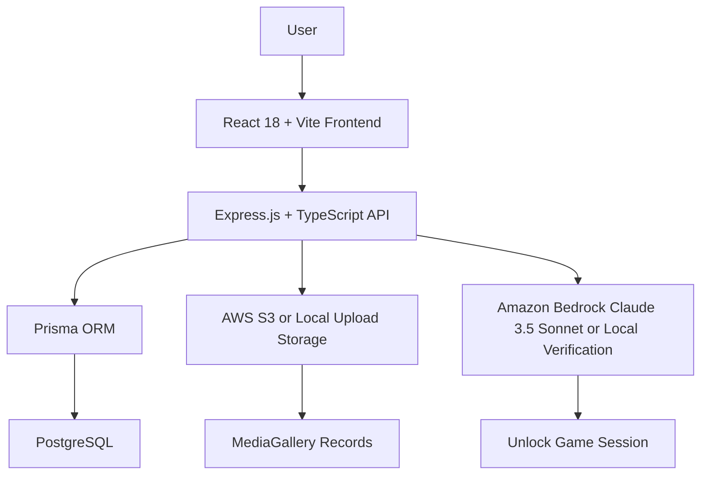
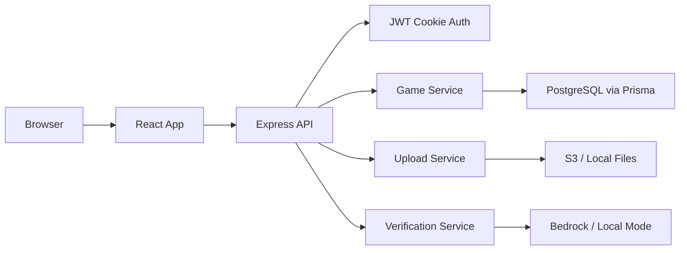
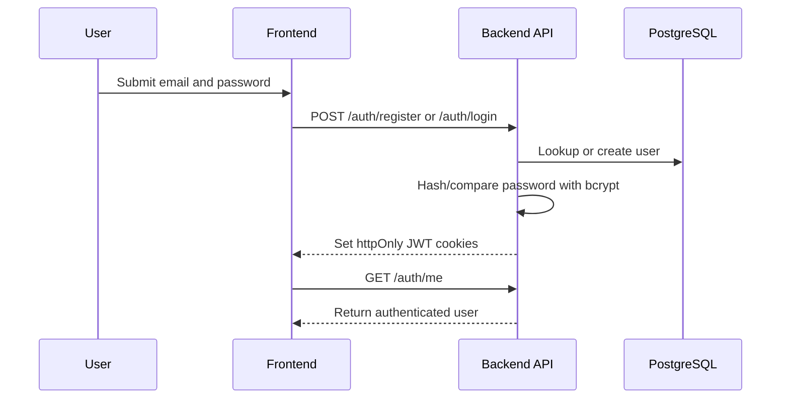
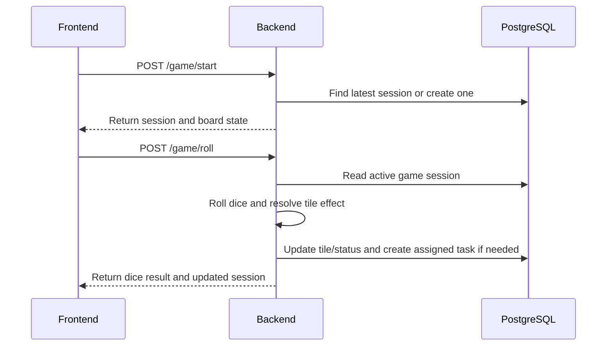
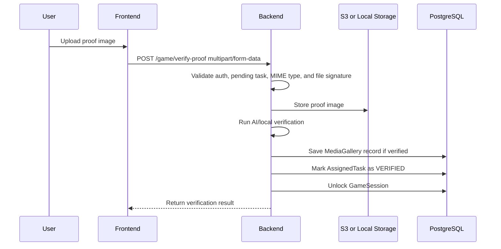
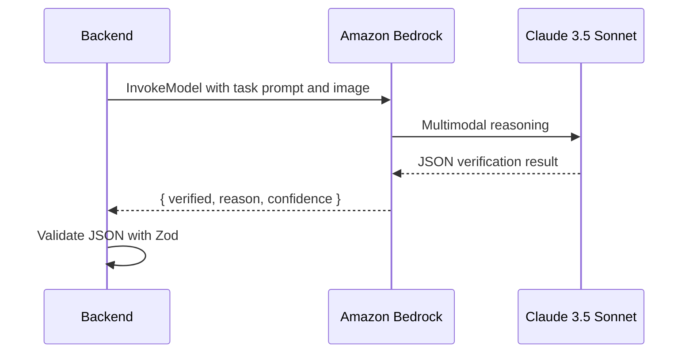

# System Architecture

Productivity Arcade is a full-stack web application with a React frontend, Express backend, PostgreSQL database, Prisma ORM, optional AWS S3 media storage, and optional Amazon Bedrock Claude 3.5 Sonnet verification.

## High-Level Flow



## Runtime Components



## Authentication Flow



### Security Notes

- Access and refresh tokens are stored in httpOnly cookies.
- Passwords are hashed with bcrypt.
- API routes are protected with auth middleware.
- Zod validates request payloads.
- Rate limiting is applied to auth, game, and upload routes.

## Game Persistence Flow



The session is stored in `GameSession`, so users can close the browser and return later.

## Image Upload Flow



## AI Verification Flow



Expected model output:

```json
{
  "verified": true,
  "reason": "The image shows evidence matching the assigned task.",
  "confidence": 0.92
}
```

## Local Development Mode

For fast local testing without AWS:

```bash
STORAGE_DRIVER=local
VERIFICATION_DRIVER=local
```

For production cloud mode:

```bash
STORAGE_DRIVER=s3
VERIFICATION_DRIVER=bedrock
```
